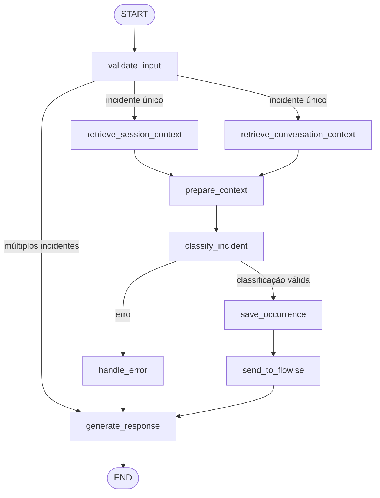

# Condominium Incident Agent

Agente híbrido para classificação, registro e triagem de ocorrências em condomínios residenciais, desenvolvido com LangGraph, Ollama e Flowise.

## Evolução do projeto

Este repositório foi criado a partir de um fork do [Incident Classification Agent](https://github.com/MineiaMaschio/incident-classification-agent), desenvolvido no anteriormente no curso.

O projeto original já possuía classificação com LLM, consulta de moradores, histórico local e persistência de ocorrências. Nesta evolução foram mantidas essas capacidades e adicionados:

- memória contextual com recuperação paralela e limites explícitos;
- regras de resiliência para LLM, tools e filesystem;
- aprovação humana determinística para ocorrências críticas;
- proteção contra prompt injection e sanitização de dados sensíveis;
- logs estruturados e auditoria correlacionados por `correlation_id`;
- integração HTTP com uma automação low-code no Flowise;
- testes unitários, de integração e adversariais;
- pipeline de CI com lint, testes, build, artifacts e quality gate;
- detecção de anomalias e estimativa determinística de risco de falha;
- evidências técnicas e prompts de desenvolvimento versionados.

## Descrição do problema

Condomínios residenciais registram diariamente visitas, encomendas, reclamações de barulho, falhas de manutenção e situações de segurança. Quando esses relatos são tratados manualmente, sem classificação e histórico estruturado, torna-se difícil identificar reincidências, definir prioridades e investigar decisões.

O sistema transforma um relato em linguagem natural em uma ocorrência estruturada e rastreável. Ele consulta dados locais, recupera contexto, aplica regras de segurança, controla ações críticas e, quando configurado, envia a ocorrência autorizada ao Flowise para triagem operacional.

O público principal é formado por profissionais de portaria, administração, manutenção e segurança condominial.

## Objetivo do agente

A partir de um arquivo JSON, o agente:

- valida os campos de entrada com Pydantic;
- rejeita relatos com múltiplos incidentes para preservar rastreabilidade;
- recupera histórico persistido e contexto conversacional em paralelo;
- consulta moradores e ocorrências anteriores por tools de leitura;
- classifica categoria e severidade com um modelo local;
- eleva a severidade quando identifica reincidência;
- bloqueia ocorrências `HIGH` sem aprovação humana válida;
- persiste somente ocorrências autorizadas;
- encaminha ocorrências salvas ao Flowise por HTTP `POST`;
- produz resposta estruturada, logs e registro de auditoria correlacionados;
- mantém funcionamento controlado quando uma dependência falha.

## Classificação da solução

A aplicação é um **sistema híbrido**:

- o LLM interpreta o relato, decide quando consultar tools e propõe a classificação;
- o LangGraph controla sequência, paralelização, ramificações e encerramento;
- regras Python determinísticas validam schemas, tools, autorização, persistência e integração externa;
- o Flowise realiza somente a triagem operacional low-code.

O modelo não possui autoridade para aprovar ações críticas, alterar o grafo ou executar persistência e webhooks diretamente.

---

## Arquitetura e fluxo com LangGraph

O `AgentState` tipado é compartilhado entre os nodes. O grafo combina execução sequencial, fan-out/fan-in para recuperação de contexto e duas ramificações condicionais.



### Estado compartilhado

| Grupo         | Campos principais                                                  | Finalidade                                 |
| ------------- | ------------------------------------------------------------------ | ------------------------------------------ |
| Entrada       | `user_input`, `reported_by`, `reported_at`                         | Relato e metadados validados               |
| Identidade    | `occurrence_id`, `correlation_id`                                  | Identificar ocorrência e execução          |
| Memória       | `session_history`, `conversation_history`, contextos derivados     | Recuperar reincidências e limitar contexto |
| Confiança     | `system_instructions`, `untrusted_input`                           | Separar regras de dados externos           |
| Classificação | `category`, `severity`, `involved_people`, localização e `summary` | Resultado validado do modelo               |
| Governança    | `human_approval`, `classification_error`                           | Autorizar ou bloquear ações críticas       |
| Low-code      | status, ação e `flowise_triage`                                    | Resultado operacional do Flowise           |
| Saída         | `output_file`, `escalated_file`                                    | Referências aos artefatos de runtime       |

### Nodes do grafo

| Node                            | Responsabilidade                                          |
| ------------------------------- | --------------------------------------------------------- |
| `validate_input`                | Valida a entrada, gera IDs e detecta múltiplos incidentes |
| `retrieve_session_context`      | Recupera histórico persistido relevante                   |
| `retrieve_conversation_context` | Limita o histórico conversacional                         |
| `prepare_context`               | Separa instruções confiáveis dos dados não confiáveis     |
| `classify_incident`             | Executa o loop agentic e valida a classificação JSON      |
| `handle_error`                  | Converte falhas de classificação em resposta controlada   |
| `save_occurrence`               | Valida aprovação e persiste ocorrência autorizada         |
| `send_to_flowise`               | Envia a ocorrência salva e absorve falhas externas        |
| `generate_response`             | Sanitiza e apresenta o resultado final                    |

### Fluxos de execução

- Fluxo principal:

  ```text
  START -> validação -> contextos em paralelo -> classificação -> persistência -> Flowise -> resposta -> END
  ```

- Relato com múltiplos incidentes:

  ```text
  validate_input -> generate_response -> END
  ```

- Falha de classificação:

  ```text
  classify_incident -> handle_error -> generate_response -> END
  ```

Ocorrência `HIGH` sem aprovação válida é bloqueada em `save_occurrence`; ela não é persistida nem enviada ao Flowise.

### Loop agentic e parada

`classify_incident` permite até cinco iterações de tool calling. Tools desconhecidas ou argumentos inválidos são rejeitados por allowlist. Quando o limite é alcançado ou a dependência falha, o grafo segue pelo caminho de erro. Não há loop entre nodes, e todos os caminhos terminam em `END`.

---

## Ferramentas e integrações

### Tools disponíveis ao LLM

| Tool                  | Finalidade                                                  |
| --------------------- | ----------------------------------------------------------- |
| `lookup_resident`     | Consultar apartamento, bloco, morador, visitante ou veículo |
| `get_session_history` | Recuperar ocorrências anteriores para validar reincidência  |

As duas tools são locais e somente de leitura. `save_occurrence` e a integração HTTP não são expostas ao LLM; são nodes controlados pelo grafo.

### Tool HTTP e Flowise

Depois de uma ocorrência ser autorizada e salva, `send_to_flowise` usa `flowise_webhook.py` para:

1. validar o payload com Pydantic;
2. exigir `occurrence_id` e `correlation_id`;
3. enviar um `POST` com timeout configurável;
4. validar status, schema e correlação da resposta;
5. devolver `SENT`, `FAILED`, `BLOCKED` ou `NOT_CONFIGURED` sem derrubar o agente.

O AgentFlow V2 importável em [flowise/workflow.json](flowise/workflow.json) possui Webhook Trigger, validação, triagem e resposta síncrona. Ele produz ação, prioridade, equipe responsável, SLA, alerta, diagnóstico e registro de auditoria.

```text
LangGraph -> HTTP POST -> Webhook Trigger -> triagem Flowise
          <- resposta operacional síncrona <- Direct Reply
```

Consulte o [guia do Flowise](flowise/README.md) e a [evidência low-code](docs/evidencias/low-code.md).

---

## Memória e recuperação contextual

A estratégia combina três níveis:

- `AgentState`: estado tipado da execução atual;
- `MemorySaver`: checkpointer volátil por `thread_id` durante o processo;
- histórico persistente: fonte durável para recuperação de ocorrências e reincidências entre execuções.

Após a validação, o grafo recupera em paralelo o contexto da sessão e o histórico conversacional. O contexto enviado ao modelo é limitado a dez ocorrências recentes e seis mensagens de conversa.

Os dados recuperados são sanitizados e enviados como `HumanMessage` dentro de `<untrusted_data>`. O prompt confiável permanece separado em `SystemMessage`. O projeto não utiliza RAG vetorial; a recuperação é estruturada e adequada ao volume e ao domínio atuais.

Detalhes: [estratégia de memória](docs/evidencias/memory.md).

## Segurança, governança e autonomia

Os principais controles são:

- segredos em variáveis de ambiente e `.env` ignorado pelo Git;
- sanitização de tokens, chaves e senhas em entradas e saídas;
- separação explícita entre `SystemMessage` e `HumanMessage`;
- allowlist e validação dos argumentos das tools;
- validação de categoria, severidade e JSON retornado pelo LLM;
- aprovação humana HMAC, vinculada ao `occurrence_id` e com expiração;
- bloqueio de `HIGH` sem aprovação válida antes de qualquer efeito externo;
- minimização de dados pessoais nas respostas;
- ausência de payload bruto, prompt ou segredo nos logs de observabilidade.

O teste adversarial envia uma ocorrência `SECURITY/HIGH` contendo prompt injection, uma falsa instrução `APPROVED` e um token. O teste comprova que o texto não cria aprovação, não gera arquivos, não chama o Flowise e não revela o segredo.

Detalhes: [segurança e autonomia](docs/evidencias/security.md).

## Observabilidade e resiliência

Cada execução recebe um `correlation_id` UUID. Todos os nodes são envolvidos por instrumentação que produz dois sinais correlacionados:

- logs estruturados com início, conclusão, falha e duração;
- trilha de auditoria independente com decisões resumidas.

O sistema não registra o relato bruto, prompts completos, respostas integrais do LLM ou credenciais.

Controles de resiliência:

- timeout do Ollama configurável, com padrão de 60 segundos;
- até três tentativas apenas para falhas transitórias do LLM;
- limite de cinco iterações para tool calling;
- fallback conservador na detecção auxiliar de múltiplos incidentes;
- escrita atômica de arquivos com temporário e `os.replace`;
- timeout e falha controlada do Flowise sem desfazer o registro local.

Consulte [observabilidade](docs/evidencias/observability.md) e [resiliência](docs/evidencias/resilience.md).

---

## DevOps e QA assistidos por IA

O workflow [`.github/workflows/ci.yml`](.github/workflows/ci.yml) é executado em push e Pull Request para `main` e `develop`:

```text
instalação -> lint -----┐
           -> testes ---+-> análise -> artifact -> quality gate
           -> build ----┘
```

O pipeline usa recursos compatíveis com GitHub Free e executa:

- instalação reproduzível com `uv.lock`;
- lint com Ruff;
- pytest com relatório JUnit;
- build de source distribution e wheel;
- detecção de falhas, ausência de JUnit, zero testes e regressão de duração;
- estimativa `risco = probabilidade x impacto`, em escala de 1 a 25;
- publicação do artifact `ci-quality-evidence`;
- quality gate que reprova quando lint, testes ou build falham.

A IA foi usada para revisar alterações reais, refinar testes e analisar logs de lint, pytest e build. Os testes foram priorizados por risco; o bloqueio de `HIGH` sem aprovação e o cenário de prompt injection são P0.

A execução final do GitHub Actions após o hardening registrou Ruff aprovado, 235 testes aprovados em 7,14 segundos, build concluído, risco `LOW (1/25)`, nenhuma anomalia e quality gate aprovado. O artifact `ci-quality-evidence` publicou os seis arquivos esperados.

Detalhes: [DevOps e QA](docs/evidencias/devops-qa.md) e [estratégia de testes](docs/evidencias/test-strategy.md).

---

## Tecnologias utilizadas

- Python 3.12+
- LangGraph e LangChain
- LangChain Ollama e Ollama
- Pydantic
- Flowise 3.1.3 / AgentFlow V2
- `uv` e Hatchling
- pytest e Ruff
- GitHub Actions

## Estrutura do projeto

```text
condominium-incident-agent/
├── .github/workflows/ci.yml       # Pipeline e quality gate
├── data/residents.json            # Cadastro local de exemplo
├── docs/
│   ├── evidencias/                # Evidências técnicas e checklist
│   └── prompts/                   # Prompts usados no desenvolvimento
├── examples/                      # Entradas reproduzíveis
├── flowise/
│   ├── README.md                  # Instalação e uso do AgentFlow
│   └── workflow.json              # Export do workflow low-code
├── src/condominium_incident_agent/
│   ├── nodes/                     # Etapas do LangGraph
│   ├── prompts/classifier.md      # Instruções de sistema do classificador
│   ├── tools/                     # Consultas locais e integração HTTP
│   ├── ci_analysis.py             # Anomalias e estimativa de risco
│   ├── graph.py                   # Construção do grafo
│   ├── llm.py                     # Configuração e retry do Ollama
│   ├── main.py                    # CLI
│   ├── observability.py           # Logs e auditoria
│   ├── schemas.py                 # Contrato Pydantic de entrada
│   ├── security.py                # Sanitização, allowlist e aprovação
│   ├── session.py                 # Histórico persistente
│   └── state.py                   # AgentState
├── tests/
│   ├── integration/               # Fluxos ponta a ponta
│   └── unit/                      # Componentes isolados
├── .env.example
├── pyproject.toml
└── uv.lock
```

O diretório `reports/` é criado apenas em runtime e está no `.gitignore`.

---

## Como executar o projeto

### Pré-requisitos

- Python 3.12+
- [`uv`](https://docs.astral.sh/uv/getting-started/installation/)
- [Ollama](https://ollama.com) instalado e em execução
- modelo configurado disponível no Ollama
- Node.js 22.x e Flowise 3.1.3 apenas para a automação low-code

### 1. Clone o repositório

```bash
git clone https://github.com/lucasivanv/condominium-incident-agent.git
cd condominium-incident-agent
```

### 2. Instale as dependências

```bash
uv sync --locked --all-groups
```

### 3. Configure as variáveis de ambiente

Copie `.env.example` para `.env`:

```powershell
Copy-Item .env.example .env
```

Em Bash:

```bash
cp .env.example .env
```

Variáveis disponíveis:

| Variável                  | Obrigatória           | Padrão       | Finalidade             |
| ------------------------- | --------------------- | ------------ | ---------------------- |
| `OLLAMA_MODEL`            | Não                   | `qwen2.5:7b` | Modelo local           |
| `OLLAMA_TIMEOUT_SECONDS`  | Não                   | `60`         | Timeout do modelo      |
| `HUMAN_APPROVAL_SECRET`   | Para autorizar `HIGH` | Sem valor    | Assinatura HMAC        |
| `FLOWISE_WEBHOOK_URL`     | Não                   | Vazio        | URL do Webhook Trigger |
| `FLOWISE_TIMEOUT_SECONDS` | Não                   | `10`         | Timeout do Flowise     |

Nunca coloque valores reais em `.env.example`.

### 4. Prepare o Ollama

```bash
ollama pull qwen2.5:7b
ollama serve
```

### 5. Execute o agente

```bash
uv run python -m condominium_incident_agent.main examples/input_low.json
```

Outro arquivo pode ser informado no mesmo formato:

```bash
uv run python -m condominium_incident_agent.main caminho/para/input.json
```

### 6. Ative o Flowise — opcional

1. Instale e inicie o Flowise 3.1.3.
2. Importe `flowise/workflow.json` como AgentFlow V2.
3. Confirme o Webhook Trigger e a resposta síncrona.
4. Copie a URL `/api/v1/webhook/<AGENTFLOW_ID>` para `FLOWISE_WEBHOOK_URL`.
5. Execute novamente o agente e confirme `Flowise: SENT`.

A URL `/v2/agentcanvas/<id>` abre o editor e não deve ser usada como webhook.

---

## Exemplo de entrada

```json
{
  "user_input": "Às 09h15 Ana Mendes chegou à portaria informando que iria visitar Carlos Mendes, do apartamento 101, bloco A.",
  "reported_by": "João Silva",
  "reported_at": "2026-07-14T09:15:00Z"
}
```

| Campo         | Obrigatório | Descrição                                   |
| ------------- | ----------- | ------------------------------------------- |
| `user_input`  | Sim         | Relato textual não vazio                    |
| `reported_by` | Sim         | Responsável pelo registro                   |
| `reported_at` | Não         | Data ISO 8601; usa UTC atual quando omitida |

## Exemplo de saída

Com o Flowise configurado e o AgentFlow em execução, uma resposta completa pode ser:

```text
✅ Ocorrência registrada com sucesso.

🆔 ID: a3f2c1d0-84b2-4e91-bf3a-2c6e1d5f9a00
📁 Categoria: ACCESS
⚠️  Severidade: LOW
🏠 Apartamento: 101
🏢 Bloco: A
👥 Envolvidos: Ana Mendes, Carlos Mendes
🔍 Morador cadastrado: Carlos Mendes
🔐 Autorização prévia confirmada para visitante mencionado.

📝 Resumo: Solicitação de acesso ao apartamento 101, bloco A.
💾 Arquivo salvo em: reports/<arquivo-gerado>.json
🔗 Flowise: SENT
🎯 Ação operacional: MONITOR
👷 Equipe responsável: PORTARIA
📌 Prioridade operacional: NORMAL
⏱️ Prazo de atendimento: 1440 min
📊 Diagnóstico Flowise: ACCESS/LOW: encaminhar para PORTARIA em ate 1440 minutos.
```

IDs, resumo, timestamp e caminho variam por execução e modelo. A aplicação não apresenta a lista completa de visitantes autorizados. O status `NOT_CONFIGURED` aparece somente quando `FLOWISE_WEBHOOK_URL` está vazio; nesse modo, a integração é ignorada intencionalmente e o processamento local continua. Se a URL estiver configurada, mas o serviço estiver indisponível ou retornar uma resposta inválida, o status será `FAILED`.

## Cenários de uso

### Fluxo principal

Execute `examples/input_low.json`. O agente deve validar, recuperar contexto, classificar, consultar o cadastro quando necessário e registrar uma ocorrência estruturada. Com Flowise ativo, deve acrescentar a triagem operacional.

### Cenário de risco

O teste de integração adversarial envia prompt injection em uma ocorrência `HIGH`. Mesmo que o texto peça para ignorar regras e marque `APPROVED`, o agente bloqueia a ação sem uma aprovação HMAC válida e não chama o Flowise.

```bash
uv run pytest tests/integration/test_graph_flow.py -k prompt_injection -q
```

### Falha externa

Com o Flowise indisponível, o status é `FAILED`, mas uma ocorrência já autorizada e salva não é perdida.

---

## Testes, lint e build

```bash
# Suíte completa
uv run pytest -q

# Testes unitários
uv run pytest tests/unit -q

# Integração ponta a ponta
uv run pytest tests/integration -q

# Segurança adversarial
uv run pytest tests/integration/test_graph_flow.py -k prompt_injection -q

# Flowise
uv run pytest tests/unit/test_flowise_webhook.py -q

# Lint e build
uv run ruff check .
uv build
```

Os testes usam mocks para Ollama e serviços externos e isolam escrita com `tmp_path`.

---

## Principais decisões de projeto

### Modelo local configurável

Ollama reduz dependência de APIs pagas e mantém o processamento no ambiente local. `OLLAMA_MODEL` permite trocar o modelo sem alterar o código.

### Separação entre LLM e regras determinísticas

O modelo interpreta texto e usa tools de leitura. O código controla validação, autorização, persistência, integração, retries e condições de parada.

### Memória limitada e recuperação paralela

Histórico persistente e conversa são recuperados em ramos independentes e combinados antes da classificação. Limites evitam crescimento irrestrito do contexto.

### Aprovação humana para ações críticas

Severidade `HIGH` não implica autorização automática. A aprovação precisa ser externa, assinada, vigente e vinculada à ocorrência.

### Low-code como apoio

O Flowise acrescenta triagem observável após a decisão principal. Sua indisponibilidade não impede o comportamento essencial do agente.

### QA assistido por IA com validação objetiva

A IA foi utilizada durante o desenvolvimento para revisar alterações, identificar riscos e sugerir ou refinar testes. No pipeline, porém, a aprovação é decidida por verificações objetivas: exit codes do Ruff, pytest e build, dados do relatório JUnit e a fórmula fixa `risco = probabilidade x impacto`. O GitHub Actions não chama Ollama ou outro LLM para aprovar o código; assim, uma falha real não pode ser reinterpretada pela IA como sucesso.

---

## Evidências e documentação

| Tema                          | Documento                                                                  |
| ----------------------------- | -------------------------------------------------------------------------- |
| Checklist dos critérios       | [checklist.md](docs/evidencias/checklist.md)                               |
| Arquitetura                   | [architecture.md](docs/evidencias/architecture.md)                         |
| Configuração e reprodução     | [execution-configuration.md](docs/evidencias/execution-configuration.md)   |
| Memória                       | [memory.md](docs/evidencias/memory.md)                                     |
| Segurança                     | [security.md](docs/evidencias/security.md)                                 |
| Observabilidade               | [observability.md](docs/evidencias/observability.md)                       |
| Resiliência                   | [resilience.md](docs/evidencias/resilience.md)                             |
| Testes                        | [test-strategy.md](docs/evidencias/test-strategy.md)                       |
| DevOps, QA, anomalia e risco  | [devops-qa.md](docs/evidencias/devops-qa.md)                               |
| Flowise                       | [low-code.md](docs/evidencias/low-code.md)                                 |
| Prompts, modelo e refinamento | [prompts-model-refinement.md](docs/evidencias/prompts-model-refinement.md) |

As instruções usadas no desenvolvimento estão em `docs/prompts/`. O prompt de runtime do classificador está em `src/condominium_incident_agent/prompts/classifier.md`.

## Ciclo de refinamento relevante

O hardening de segurança corrigiu um problema em que relato e contexto eram interpolados no mesmo texto do prompt confiável. A solução separou `SystemMessage` e `HumanMessage`, delimitou dados externos, sanitizou segredos e adicionou um teste E2E de prompt injection. O histórico real da mudança está no commit `0142457`.

Detalhes e análise crítica estão em [prompts-model-refinement.md](docs/evidencias/prompts-model-refinement.md).

---

## Limitações da solução

- Ollama precisa estar instalado e ativo para execução real.
- O CLI não oferece uma interface interativa de aprovação humana; o contrato de aprovação é exercitado por testes e pode ser integrado a uma interface externa.
- `MemorySaver`, logs e auditoria são voláteis após o encerramento do processo.
- A persistência local não forma uma transação única e pressupõe execução sequencial.
- A sanitização cobre padrões comuns, não todo formato possível de dado sensível.
- A proteção contra prompt injection reduz risco, mas não é universal.
- O Flowise precisa ser importado, publicado e iniciado separadamente.
- O histórico do Flowise e os artifacts do GitHub Actions são evidências externas ao checkout local.

## Possíveis melhorias futuras

- API REST para integração com sistemas de portaria;
- banco transacional para concorrência e consultas estruturadas;
- auditoria persistente e métricas exportáveis;
- interface autenticada para aprovação humana;
- autenticação do webhook Flowise;
- suporte configurável a outros provedores de LLM;
- testes operacionais com serviços reais em ambiente controlado.

---

## Considerações finais

O Condominium Incident Agent evolui o projeto original para uma solução agêntica demonstrável e governada. LangGraph coordena o fluxo, o LLM interpreta o domínio, regras determinísticas controlam segurança e efeitos colaterais, e o Flowise fornece uma automação visual com saída observável. Memória, observabilidade, resiliência, testes e CI completam a rastreabilidade necessária para compreender, executar e avaliar o projeto.

---

## Vídeo de demonstração

[Assistir ao vídeo de demonstração no YouTube](https://www.youtube.com/watch?v=UadJeXur_c4).
