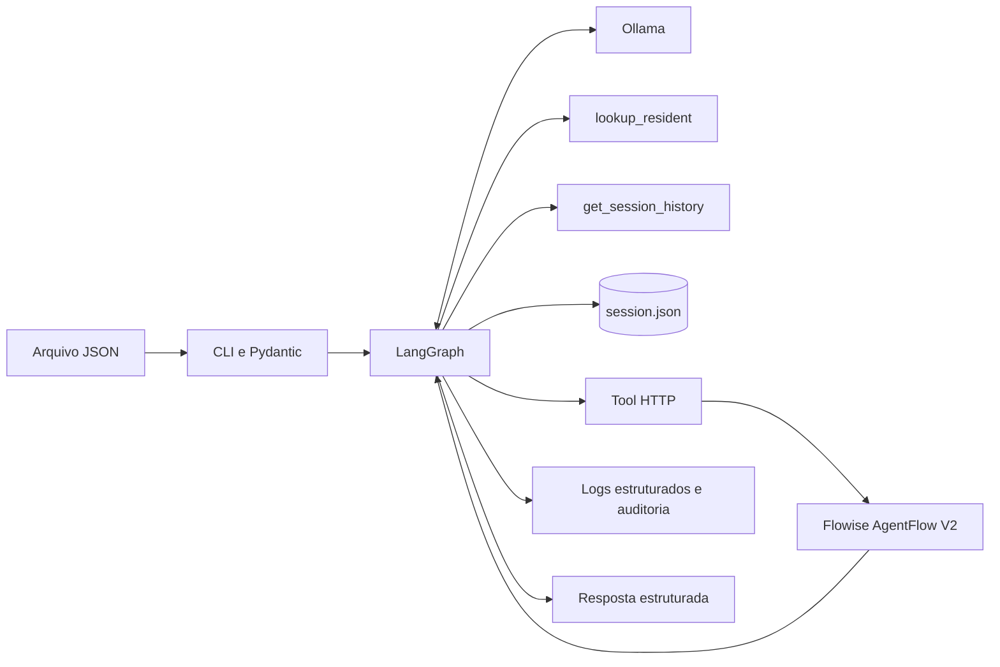
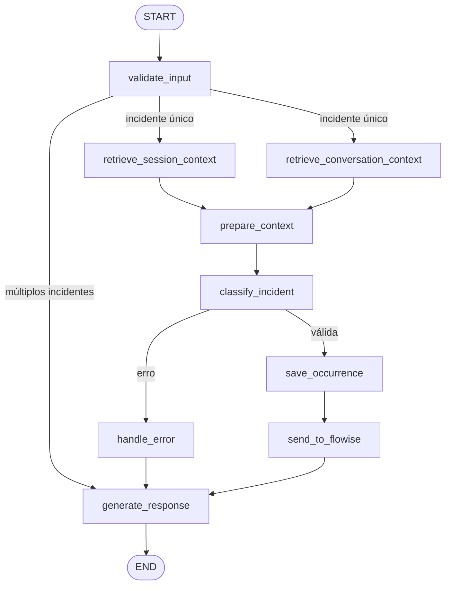

# Arquitetura Agêntica e LangGraph

**Data da evidência:** 2026-08-27 **Escopo:** domínio, estado, nodes, edges, paralelização, decisões, integrações e condições de parada.

## Objetivo e classificação

O Condominium Incident Agent recebe relatos de ocorrências residenciais e os transforma em classificações e encaminhamentos rastreáveis. O público principal é a equipe de portaria, administração e segurança do condomínio.

A solução é um **sistema híbrido**:

- o LLM interpreta linguagem natural, consulta contexto e propõe categoria, severidade, envolvidos, localização e resumo;
- o LangGraph controla a sequência, as ramificações e o encerramento;
- regras Python determinísticas validam schemas, tools, aprovação humana, persistência, integração externa e tratamento de falhas;
- o Flowise complementa o fluxo com uma triagem operacional low-code, sem assumir classificação ou autorização.

## Entradas e saídas

A entrada é validada por `IncidentInput`, em `src/condominium_incident_agent/schemas.py`:

| Campo | Regra |
| --- | --- |
| `user_input` | Relato obrigatório e não vazio |
| `reported_by` | Responsável pelo registro, obrigatório |
| `reported_at` | Data ISO 8601; usa UTC atual quando omitida |

A execução produz um `AgentState` estruturado com classificação, IDs, contexto, status de autorização e resultado do Flowise. Em sucesso, a aplicação apresenta uma resposta legível no terminal e gera artefatos JSON de runtime. Os artefatos de runtime são ignorados pelo Git e não são usados como única evidência acadêmica.

## Componentes



| Componente | Responsabilidade |
| --- | --- |
| CLI | Carregar JSON, validar entrada e iniciar o grafo |
| `AgentState` | Contrato tipado compartilhado entre os nodes |
| Ollama | Interpretação semântica com temperatura zero |
| Tools de leitura | Consultar moradores e histórico persistido |
| Persistência | Manter histórico durável e artefatos operacionais |
| Tool HTTP | Validar e enviar ocorrência autorizada por `POST` |
| Flowise | Produzir ação, prioridade, equipe, SLA e diagnóstico |
| Observabilidade | Correlacionar logs e auditoria por execução |

## Estado compartilhado

`AgentState`, definido em `src/condominium_incident_agent/state.py`, é um `TypedDict`. Seus grupos principais são:

| Grupo | Campos principais | Finalidade |
| --- | --- | --- |
| Entrada | `user_input`, `reported_by`, `reported_at` | Dados originais validados |
| Identidade | `occurrence_id`, `correlation_id` | Ocorrência e rastreabilidade |
| Memória | `session_history`, `conversation_history`, contextos derivados | Recuperação contextual limitada |
| Confiança | `system_instructions`, `untrusted_input` | Separar regras de dados externos |
| Classificação | `category`, `severity`, `involved_people`, localização e `summary` | Resultado semântico validado |
| Governança | `human_approval`, `classification_error` | Autorizar ou bloquear ações críticas |
| Low-code | `flowise_delivery_status`, `flowise_action`, `flowise_triage` | Resultado externo controlado |
| Saída | `output_file`, `escalated_file` | Referências a artefatos de runtime |

O `MemorySaver` preserva o estado por `thread_id` apenas durante a vida do processo. O histórico durável de ocorrências é mantido separadamente e recuperado no início de novas execuções.

## Nodes e responsabilidades

| Node | Responsabilidade | Natureza predominante |
| --- | --- | --- |
| `validate_input` | Validar entrada, gerar ID e detectar relatos múltiplos | Validação determinística com interpretação auxiliar do LLM |
| `retrieve_session_context` | Recuperar histórico persistido relevante | Determinística |
| `retrieve_conversation_context` | Limitar histórico conversacional | Determinística |
| `prepare_context` | Separar instruções confiáveis dos dados externos | Determinística |
| `classify_incident` | Consultar tools e produzir classificação JSON | LLM com validação determinística |
| `handle_error` | Converter falha de classificação em estado controlado | Determinística |
| `save_occurrence` | Validar aprovação e persistir ocorrência autorizada | Determinística |
| `send_to_flowise` | Encaminhar ocorrência salva e absorver falha externa | Determinística |
| `generate_response` | Sanitizar e apresentar o resultado final | Determinística |

O LLM recebe somente `lookup_resident` e `get_session_history`, ambas de leitura. Persistência, aprovação e integração HTTP não são tools disponíveis ao modelo.

## Fluxo do grafo



O fan-out após `validate_input` executa duas recuperações independentes. Cada ramo escreve uma chave distinta, e `prepare_context` realiza o fan-in antes da classificação.

As ramificações encerram de forma explícita:

- múltiplos incidentes seguem diretamente para resposta, sem classificação;
- erro de classificação passa por `handle_error`, sem persistência;
- ocorrência `HIGH` sem aprovação válida é bloqueada antes de qualquer envio;
- falha do Flowise não desfaz a ocorrência local e retorna status controlado;
- todos os caminhos alcançam `generate_response` e depois `END`.

O grafo não possui loop entre nodes. O único loop é o de chamadas de tools no classificador, limitado a cinco iterações.

## Fronteiras de decisão

O LLM pode interpretar o relato, mas não pode:

- conceder aprovação humana;
- gravar arquivos diretamente;
- chamar a integração HTTP;
- alterar edges, limites ou regras de segurança;
- aceitar uma tool fora da allowlist.

Os dados externos são enviados como `HumanMessage` delimitada por `<untrusted_data>`. As regras permanentes permanecem em `SystemMessage`. O JSON retornado é validado contra categorias e severidades conhecidas antes de qualquer efeito colateral.

## Cenários reproduzíveis

### Fluxo principal

`examples/input_low.json` representa uma solicitação de acesso. Com Ollama ativo, a execução deve validar o relato, consultar contexto quando necessário, classificar e produzir uma resposta estruturada. Se o Flowise estiver configurado, a resposta também apresenta a triagem operacional.

```bash
uv run python -m condominium_incident_agent.main examples/input_low.json
```

### Cenário de risco

O teste de integração adversarial envia uma tentativa de invasão com prompt injection e uma falsa instrução `APPROVED`. O grafo classifica o caso como `HIGH`, exige aprovação válida e comprova que não há persistência nem chamada ao Flowise.

```bash
uv run pytest tests/integration/test_graph_flow.py -k prompt_injection -q
```

## Evidências e limitações

As decisões arquiteturais são exercitadas por `tests/integration/test_graph_flow.py`; memória, segurança, observabilidade e Flowise possuem testes unitários próprios. Os comandos completos estão em `execution-configuration.md`.

Limitações atuais:

- `MemorySaver` e os sinais de observabilidade são voláteis;
- a persistência em arquivos pressupõe execução sequencial;
- não há interface interativa de aprovação humana no CLI;
- Ollama e Flowise são serviços locais e precisam ser iniciados separadamente;
- a proteção contra prompt injection reduz risco, mas não é um detector universal.
