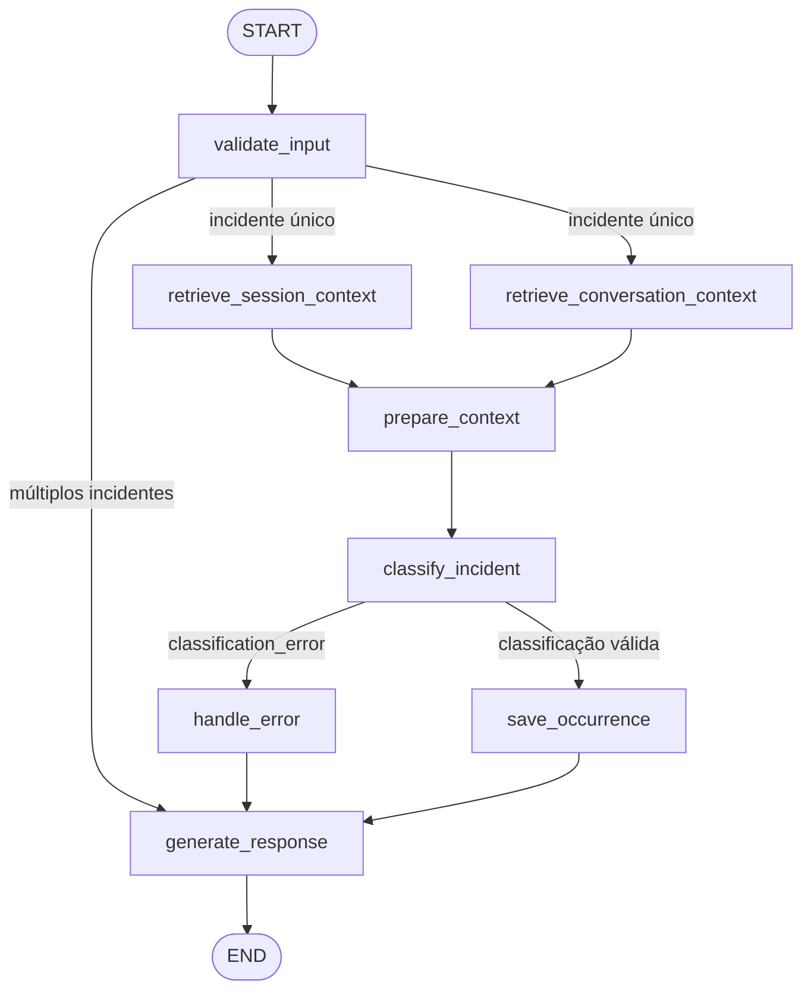

# Arquitetura Agêntica e LangGraph

**Data da evidência:** 2026-08-23  
**Ambiente:** Windows 11, Python 3.12.13, uv, LangGraph 1.2.9, pytest 9.1.1  
**Escopo:** estado compartilhado, nodes, edges, decisões, paralelização,
condições de parada e testes do grafo.

---

## Objetivo

Modelar o processamento de uma ocorrência de condomínio como um sistema
híbrido: o LLM interpreta o texto e classifica o incidente, enquanto o
workflow LangGraph controla ordem, roteamento, validação, segurança,
persistência e encerramento.

O refinamento mantém a arquitetura existente e torna explícito o fan-out/fan-in
das duas recuperações de contexto que não dependem uma da outra.

## Estado compartilhado

`AgentState`, definido em `src/condominium_incident_agent/state.py`, é um
`TypedDict` usado como contrato entre os nodes. Ele reúne:

| Grupo | Campos principais | Finalidade |
| --- | --- | --- |
| Entrada | `user_input`, `reported_by`, `reported_at` | Relato e metadados originais |
| Identidade | `occurrence_id`, `correlation_id` | Rastreamento da ocorrência e da execução |
| Contexto | `session_history`, `session_context`, `conversation_history`, `conversation_context` | Memória persistida e histórico limitado para o prompt |
| Classificação | `category`, `severity`, `involved_people`, `apartment`, `building`, `summary`, `resident_info` | Resultado semântico produzido e validado |
| Controle | `multiple_incidents_detected`, `classification_error`, `human_approval` | Roteamento, falhas e governança |
| Saída | `output_file`, `escalated_file` | Evidência de persistência e escalonamento |

O `MemorySaver` preserva o estado por `thread_id` durante a vida do processo.
O `session.json` é a fonte durável das ocorrências e alimenta o snapshot de
histórico usado pelo contexto.

## Nodes e responsabilidades

| Node | Responsabilidade | Tipo de decisão |
| --- | --- | --- |
| `validate_input` | Valida campos obrigatórios, normaliza entrada, gera `occurrence_id` e detecta múltiplos incidentes. | LLM para interpretação; validação e normalização determinísticas |
| `retrieve_session_context` | Recupera ocorrências da sessão e monta contexto limitado por apartamento quando possível. | Regra determinística |
| `retrieve_conversation_context` | Limita o histórico conversacional ao tamanho configurado. | Regra determinística |
| `prepare_context` | Combina os contextos recuperados, sanitiza dados e monta o prompt. | Regra determinística |
| `classify_incident` | Classifica o incidente, usa tools de consulta e valida a resposta JSON. | LLM para semântica; parsing, enums e limite de loop determinísticos |
| `save_occurrence` | Valida aprovação para `HIGH`, grava relatório e atualiza sessão. | Regra determinística |
| `handle_error` | Registra falha controlada e mantém o estado pronto para resposta. | Regra determinística |
| `generate_response` | Formata a resposta de sucesso, erro ou rejeição. | Regra determinística |

O LLM recebe somente as tools de leitura `lookup_resident` e
`get_session_history`. `save_occurrence` não é exposta ao modelo.

## Fluxo do grafo

O grafo é construído em `src/condominium_incident_agent/graph.py` com
`StateGraph(AgentState)`. Todos os nodes são envolvidos por
`instrument_node`, preservando correlação e auditoria.


### Fluxo normal

1. `validate_input` valida o relato e identifica um único incidente.
2. O grafo inicia as duas recuperações independentes de contexto.
3. `prepare_context` faz o fan-in e monta a entrada do classificador.
4. `classify_incident` interpreta o relato e valida categoria e severidade.
5. `save_occurrence` persiste a ocorrência.
6. `generate_response` cria a saída final e o grafo alcança `END`.

### Ramificações condicionais

| Origem | Condição | Destino | Efeito |
| --- | --- | --- | --- |
| `validate_input` | `multiple_incidents_detected=True` | `generate_response` | Rejeição antecipada; não classifica nem persiste |
| `validate_input` | Incidente único | Dois recuperadores de contexto | Fan-out paralelo |
| `classify_incident` | `classification_error` preenchido | `handle_error` | Resposta de erro sem persistência |
| `classify_incident` | Classificação válida | `save_occurrence` | Continua para persistência |

## Separação entre LLM e regras

O LLM é usado onde há interpretação semântica:

- detectar se o relato contém múltiplos incidentes;
- escolher categoria e severidade;
- produzir envolvidos, localização e resumo;
- decidir quando consultar as tools de leitura durante a classificação.

A aplicação mantém o controle operacional e de segurança:

- valida campos, JSON e valores dos enums;
- sanitiza entrada, histórico e resultados das tools;
- limita o loop de tool calls a cinco iterações;
- controla as edges e as condições de roteamento;
- impede persistência de classificação inválida;
- exige aprovação humana válida antes de escalonar `HIGH`;
- grava relatórios e histórico de forma determinística.

Uma resposta do LLM nunca concede aprovação humana nem escolhe sozinha uma
ação crítica.

## Paralelização e fan-in

Depois de `validate_input`, estas tarefas são independentes:

- `retrieve_session_context` consulta o histórico de ocorrências;
- `retrieve_conversation_context` limita o histórico da conversa.

Cada ramo escreve uma chave distinta do estado (`session_context` ou
`conversation_context`). As duas edges convergem em `prepare_context`, que só
executa após os dois ramos concluírem. A classificação permanece após o
fan-in porque depende do contexto combinado e pode executar tools.

## Condições de parada e resiliência do fluxo

O workflow não possui loop entre nodes. Todos os caminhos terminam em
`generate_response` e depois em `END`:

- múltiplos incidentes: parada antecipada após a validação;
- erro de classificação: `handle_error` e resposta controlada;
- sucesso: persistência e resposta final.

O loop interno de tools em `classify_incident` possui limite explícito de cinco
iterações. Se o modelo não produzir uma resposta final nesse limite, o node
preenche `classification_error` e o grafo segue pelo caminho de erro. Falhas
na detecção auxiliar de múltiplos incidentes usam fallback conservador para
incidente único.

## Testes e reprodução

Os testes unitários isolam nodes e tools com mocks. Os testes de integração
executam `build_graph().invoke()` com LLM, filesystem e prompts isolados.
Os principais caminhos cobertos são:

- fluxo normal com persistência;
- classificação `LOW`, `MEDIUM` e `HIGH`;
- bloqueio de `HIGH` sem aprovação e escalonamento com aprovação válida;
- rejeição antecipada de múltiplos incidentes;
- erro de classificação sem arquivo ou atualização de sessão;
- preservação e limite do histórico de contexto;
- observabilidade por `correlation_id`;
- topologia real de fan-out/fan-in.

Comandos de reprodução:

```bash
# Testes específicos do grafo
uv run pytest tests/integration/test_graph_flow.py

# Suíte completa
uv run pytest

# Verificação estática
uv run ruff check src tests
```

Resultado mais recente: **203 testes aprovados**, Ruff aprovado e nenhum erro
estático nos arquivos do grafo, estado, contexto e integração.

## Resultado

O grafo demonstra estado tipado, nodes com responsabilidades claras, fluxo
sequencial, ramificações condicionais, paralelização simples, condições de
parada e separação entre decisões semânticas do LLM e regras determinísticas.
O diagrama acima representa as edges implementadas e os testes verificam tanto
o comportamento quanto a topologia compilada.

## Limitações conhecidas

- `MemorySaver` é volátil e perde o estado após o encerramento do processo.
- O contexto paralelo é local e síncrono do ponto de vista das funções Python;
  a concorrência é orquestrada pelo LangGraph, sem workers distribuídos.
- O `session.json` e o relatório não formam uma transação única.
- O limite de cinco iterações evita loop infinito, mas não substitui métricas
  específicas de custo ou qualidade das chamadas do LLM.
- A detecção de múltiplos incidentes continua dependente de uma decisão
  auxiliar do LLM, com fallback conservador em caso de falha.
# Arquitetura

## Visão geral

O projeto é um sistema híbrido: o LLM interpreta o relato, detecta múltiplos
incidentes e classifica categoria e severidade; o fluxo LangGraph e as regras
de segurança, validação, persistência e roteamento são determinísticos.

O `AgentState` tipado é compartilhado por todos os nodes. O `MemorySaver`
preserva o estado por `thread_id` durante a execução do processo, enquanto o
`session.json` mantém o histórico durável usado na recuperação de contexto.

## Nodes e responsabilidades

- `validate_input`: valida campos obrigatórios, gera identificador e solicita
  ao LLM a detecção de múltiplos incidentes.
- `retrieve_session_context`: recupera e limita o histórico persistido,
  incluindo ocorrências do apartamento mencionado quando possível.
- `retrieve_conversation_context`: limita o histórico conversacional existente.
- `prepare_context`: combina as duas recuperações, sanitiza dados não
  confiáveis e monta o prompt do classificador.
- `classify_incident`: chama o LLM com as tools de consulta, valida o JSON e
  impõe limite de cinco iterações do loop de tools.
- `save_occurrence`: aplica a aprovação humana para severidade `HIGH`, grava o
  relatório e atualiza o histórico de sessão.
- `handle_error`: registra falhas de classificação sem persistir ocorrência.
- `generate_response`: produz a resposta final para sucesso, erro ou rejeição.

## Fluxos e ramificações

O fluxo normal começa em `validate_input` e faz fan-out para as duas
recuperações independentes. Ambas convergem em `prepare_context` antes da
classificação. Depois de classificar, a regra `_route_after_classify` envia o
estado para `save_occurrence` ou `handle_error`. Ambos terminam em
`generate_response`.

Quando `validate_input` detecta múltiplos incidentes, a regra determinística
faz short-circuit diretamente para `generate_response`; classificação e
persistência não são executadas. Depois da resposta, o grafo sempre alcança
`END`, sem loop de workflow. O único loop interno é o de tool calls do LLM,
limitado a cinco iterações e convertido em erro controlado ao exceder o limite.



## LLM e regras determinísticas

As decisões semânticas são delegadas ao LLM: detecção de múltiplos incidentes,
classificação, resumo e eventual uso das tools `lookup_resident` e
`get_session_history`. O código valida e sanitiza todas as respostas, limita
as iterações e controla os destinos do grafo. A severidade `HIGH` não autoriza
sozinha o escalonamento: `save_occurrence` exige uma aprovação humana válida.

## Paralelização

O fan-out é restrito às tarefas independentes de recuperação: histórico de
ocorrências persistido e histórico conversacional. Elas escrevem chaves
distintas do `AgentState` (`session_context` e `conversation_context`) e
convergem em `prepare_context`. A classificação permanece depois do fan-in,
pois depende do contexto combinado e pode executar tools durante o raciocínio.

## Observabilidade e testes

Cada node é envolvido por `instrument_node`, produzindo logs estruturados e
auditoria correlacionados por `correlation_id`. Os testes de integração cobrem
fluxo normal, erro, aprovação de `HIGH`, rejeição antecipada, persistência,
limite de contexto e a topologia fan-out/fan-in.